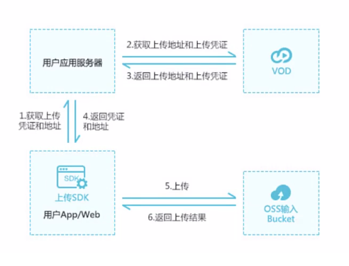

# egg-youtobe-backend

## QuickStart

<!-- add docs here for user -->
### 💛 项目目标/技术选项
- online: https://utubeclone.netlify.app/
- front-end: https://github.com/manikandanraji/youtubeclone-frontend
- back-end:  https://github.com/manikandanraji/youtubeclone-backend
- 前后端分离架构
- 先做服务端, 然后做客户端
- `后端技术选型`

| 类型 | 技术 |
| - | - |
| Web框架 | Egg.js |
| 数据库 | MongoDB |
| ORM 框架 | mongoose |
| 身份认证 | JWT |

- `客户端技术选型`
- `Vue3` 系列技术栈

### 💛 接口设计
1. 基于 Restful 规范
2. 基于 JWT 身份认证
3. 接口基础路径: /api/v1
4. 使用`CORS`处理跨域
5. 请求与响应均为 `JSON` 格式数据

### 💛 使用 Yapi 管理接口
- `github`: `https://github.com/YMFE/yapi`
- 使用我们提供的 `yapi-cli` 工具, 部署 `YApi` 平台是非常容易的. 执行 `yapi server` 启动可视化部署程序, 输入相应的配置和点击开始部署, 就能完成整个网站的部署. 部署完成之后, 可按照提示信息, 执行 `node/{网站路径/server/app.js}` 启动服务器. 在浏览器打开指定 `url`, 点击登录输入您刚才设置的管理员邮箱, 默认密码为 `ymfe.org` 登录系统(默认密码可在个人中心修改). 
- 如何部署YAPI[https://blog.csdn.net/Lb_fly0505/article/details/104670548]


### 💛 使用 Yapi - 1 - 本地搭建
- 全局安装依赖: `npm install -g yapi-cli --registry https://registry.npm.taobao.org`
- 启动数据库 `mongod --dbpath="C:\Leslie\MongoDB\data"`
- 启动配置 `yapi server`: 访问: `http://localhost:9090`
- 安装默认配置, 如果成功则出现
```
    部署日志
    当前安装版本： 1.9.2
    连接数据库成功!
    开始下载平台文件压缩包...
    http://registry.npm.taobao.org/yapi-vendor/download/yapi-vendor-1.9.2.tgz
    部署文件完成, 正在安装依赖库...
```

### 💛 使用 Yapi - 2 - 服务管理
```
    npm install pm2 -g  //安装pm2
    cd {安装my-yapi的目录}}  C:\Users\leslie\my-yapi
    pm2 start "vendors/server/app.js" --name yapi //pm2管理yapi服务
    pm2 info yapi //查看服务信息
    pm2 stop yapi //停止服务
    pm2 restart yapi //重启服务
```

### 💛 使用 Yapi - 3 - 服务管理
- 访问 `http://127.0.0.1:3000/`
- 用户名: `admin@admin.com`  密码: `ymfe.org` (默认密码)
- 用户名: `admin@admin.com`  密码: `111111` (修改后的密码)

### 💛 使用 Yapi - 4 - 扩展教程 chrome 安装 yapi 
- chrome 安装 yapi 扩展教程[https://juejin.cn/post/6844904057707085832]
- 使用 Edge 浏览器搜索 `cross-request` 添加扩展
- YApi 新版如何查看 http 请求数据[https://juejin.cn/post/6844903795743260685]

### 💛 安装 egg 脚手架工具 / Development
-  npm install -g create-egg
-  npm i
-  npm run dev
-  open http://localhost:7001/

### 💛 Plugin: egg-mongoose
- npm i egg-mongoose --save
- 找到 根目录下 `config/plugin`
```js
exports.mongoose = {
  enable: true,
  package: 'egg-mongoose',
}
```
- 配置连接: 找到`config/config.default.js`,加入下面的代码
```js
  config.mongoose = {
    client: {
      // youtobe 是 数据库
      url: 'mongodb://127.0.0.1/youtobe',
      options: {
          useUnifiedTopology: true
      },
      // mongoose global plugins, expected a function or an array of function and options
      plugins: [],
    },
  }
```

### 💛 Plugin: egg-validate: 开启 validate 插件
- `npm i egg-validate --save`
```js
//  config/plugin.js
//  在 ctx 对象上 挂载 validate 方法
exports.validate = {
  enable: true,
  package: 'egg-validate',
}
```

### 💛 统一错误处理 中间件处理
- 在 `app/middleware` 目录下新建一个 `error_handler.js` 的文件来新建一个 `middleware`
- 然后在`config.default.js`中的`middleware`中添加`中间件模块名`(驼峰命名)

### 💛 Service 服务
- `app`下添加`service`文件夹, 添加 `user.js`
```js
const Service = require('egg').Service

class UserService extends Service {
  // 定义 User 模型访问器
  get User() {
    return this.app.model.User
  }
  findByUserName() {
    this.User
  }
  findByEmail() {}
  createUser() {}
}
module.exports = UserService
```

### 💛 JWT: JSON Web Token
- `npm i jsonwebtoken --save`

### 💛 添加全局 jwt 配置
```js
// config.default.js
  config.jwt = {
    secret: '68fc7856-2359-4bd4-85d2-8e9914bb63d5',
    expiresIn: '1d',
  }
// usage in service
this.app.config.jwt.expiresIn
this.app.config.jwt.secret
```

### 💛 配置 extend: 个人理解是 utils 工具类
- 在`app`下添加`extend`文件夹, 添加`helper.js`
```js
// app/extend/helper.js
const crypto = require('crypto')
exports.md5 = (str) => {
  return crypto.createHash('md5').update(str).digest('hex')
}

// 在 xxxxService.js 中直接调用
this.ctx.helper.md5(data.password)
```
- ❗❗❗ 只有`helper.js`才能被识别

### 💛 启动 mongoDB
- mongod --dbpath="C:\Leslie\MongoDB\data"

### 使用 Model vs Service 
- `this.app.model.User`
- `this.service.user`

### 💛 router 设置基础路径
```js
router.prefix('/api/v1') // 设置基础路径
```

### 💛 关闭 csrf
```js
// config.default.js
 config.security = {
    csrf: {
      enable: false,
    },
  }
```

### 💛 npm scripts
- Use `npm run lint` to check code style.
- Use `npm test` to run unit test.
- Use `npm run autod` to auto detect dependencies upgrade, see [autod](https://www.npmjs.com/package/autod) for more detail.

### 💛npm run commit: git-cz
1. `npm install commitizen cz-conventional-changelog --save-dev`
2. 修改`package.json`
```json
"script":{
  "commit": "git-cz"
},
"config":{
  "commitizen":{
    "path": "./node_modules/cz-conventional-changelog"
  }
}
```

### 🎃🎃 声明位置/引入方法(挂载到哪个属性)
|声明位置|引入使用|DEMO|
|--|--|--|
|`/controller`|`this.app`|`this.app.controller`|
|`/service`|`this || ctx`|`this.service.user`|
|`/extend/helper.js`|`ctx`|`this.ctx.helper.md5()`|
|`/model`|`this.app`|`const User = this.app.model.User`|
|`/config/config.default.js`的`config.xxx`属性|`this.app.config`|`this.app.config.xxx`|
|`/config/plugin.js` 的 `egg-validate`|`this.ctx`|`this.ctx.validate()`|

### 🚀 Deploy
```bash
$ npm start
$ npm stop
```

### 🚀 获取当前用户信息
0. 定义`auth`中间件
1. 在`xxxService`中定义验证token的方法`verifyToken`
2. 添加路由 `router.get('/user', auth, controller.user.getCurrentUser)` 并加入`auth`中间件验证
3. 在`/controller/user.js`下添加方法`getCurrentUser`
4. `token 验证` 和 `挂载 user 到 ctx 上`已经在`auth`中间件中完成
5. 发送响应


### 🚀 lodash-pick
- `npm install lodash --save`
- 挂载到 `helper`
```js
// 挂载 lodash
exports._ = _
```

### exports vs module.exports
- `module.exports = modleName` ~~~ `export default modelName`
- `exports.something` ~~ `export something`


### 🚀 对于 populate()
- `Subscription Schema`: 订阅模型
```js
// Model Schema
  const SubscriptionSchema = new Schema({
    user: { type: mongoose.ObjectId, required: true, ref: 'User' },
    channel: { type: mongoose.ObjectId, required: true, ref: 'User' },
    createdAt: { type: Date, default: Date.now }, // 创建时间
    updatedAt: { type: Date, default: Date.now }, // 更新时间
  })
```

- 对于 `Subscription`这个数据`Model`,在查询出来数据后,实际上`user/channel`返回的都是 `ObjectId`
```js
 const subscriptions = await Subscription.find({ user: this.ctx.params.userId })
 /**
subscriptions: [
  {
    _id: 60850134ffea9353c4dc68cb,
    user: 60828c089d311c0bb0f6fa03,
    channel: 6082976eb3bfcd372c7d9aad,
    createdAt: 2021-04-25T05:42:12.738Z,
    updatedAt: 2021-04-25T05:42:12.738Z,
    __v: 0
  }
]
**/
```
- 如果希望获取真正的 `document` 数据而不是`ObjectId`, 需要对这种属性进行 `populate`, 得到如下图
```js
[
  {
    _id: 60850134ffea9353c4dc68cb,
    user: 60828c089d311c0bb0f6fa03,
    channel: { // be populated
      avatar: null,
      cover: null,
      channelDescription: 0,
      subscribersCount: '2',
      _id: 6082976eb3bfcd372c7d9aad,
      username: 'jack',
      email: 'jack@jack.com',
      createdAt: 2021-04-23T09:46:22.999Z,
      updatedAt: 2021-04-23T09:46:22.999Z,
      __v: 0
    },
    createdAt: 2021-04-25T05:42:12.738Z,
    updatedAt: 2021-04-25T05:42:12.738Z,
    __v: 0
  }
]
```


### 阿里云-视频点播
- `https://www.aliyun.com/product/vod` - 9.9 套餐
- 点播控制台
- `https://vod.console.aliyun.com/#/media/video/detail/3beed1371c954be0987918c41487ec13/video`
- 文档: `https://help.aliyun.com/document_detail/51512.html?spm=5176.12672711.0.dexternal.700d1fa3InZhJT`

### 使用上传地址和凭证方式上传
- 1. `web`客户端请求(egg.js)接口获取上传凭证和地址
- 2. 在`egg.js`中请求阿里云`vod`获取上传地址和上传凭证
- 3. 阿里云`vod`返回上传地址和上传凭证给`egg.js`
- 4. `egg.js`返回频资和地址给`web`客户端.
- 5. 上传:`OSS输入Bucket`
- 6. 返回上传结果给`web`客户端



- [Web端SDK下载](https://help.aliyun.com/document_detail/51992.htm?spm=a2c4g.11186623.2.4.4b78b227IjMTmX#topic-1959787)
- 解压进入`vue-demo`, `npm install` 然后`npm install env-cross -D`
- 修改`package.json`
```json
"scripts": {
    "test": "echo \"Error: no test specified\" && exit 1",
    "dev": "cross-env NODE_ENV=development webpack-dev-server --inline --hot --host 0.0.0.0",
    "build": "cross-env NODE_ENV=production webpack --progress"
  },
```

### 媒体上传 - 客户端上传
- [客户端上传](https://help.aliyun.com/document_detail/55398.html)
- 客户端上传, 是指将移动端(`Web`, `iOS`, `Android`)或`PC`端媒体文件上传到点播存储, 适合 `UGC`, `PGC`, 运营后台等场景.本文为您介绍客户端上传的流程, 准备工作, 部署授权, 支持的功能和提供的 `SDK`.

- 获取权限 `RAM` 访问控制台创建 `RAM` 用户,并授予 `VOD` 权限

### Vod 媒体上传 - 部署授权服务
- 在客户端上传媒体文件时, 会直接将文件上传到点播存储（基于`OSS`）, 不会再经服务端进行中转, 故客户端上传必须进行鉴权, 也就是需要您在应用服务器上部署授权服务。
- `使用上传地址和凭证上传`
- (安装`视频点播`-`服务端SDK`-`Node.js SDK`)[https://help.aliyun.com/document_detail/101351.html]
- `npm install @alicloud/pop-core --save`
- `Egg.js` 应用中 添加 `路由` 
- `router.get('/vod/CreateUploadVideo', auth, controller.vod.createUploadVideo)`
- 新增 `VodController` 在`Controller`里 初始化 `Vod Client`
```js
// src/controller/vod.js
const RPCClient = require('@alicloud/pop-core').RPCClient

function initVodClient(accessKeyId, accessKeySecret) {
  const regionId = 'cn-shanghai' // 点播服务接入区域
  const client = new RPCClient({
    accessKeyId,
    accessKeySecret,
    endpoint: 'http://vod.' + regionId + '.aliyuncs.com',
    apiVersion: '2017-03-21',
  })

  return client
}

class VodController extends Controller {
  async createUploadVideo() {
    const query = this.ctx.query

    // 验证参数
    this.ctx.validate(
      {
        Title: { type: 'string' },
        FileName: { type: 'string' },
      },
      query
    )

    const vodClient = initVodClient('LTAI5tBKLjGhbcnbbY7zgAKs', 'qi4EBj6vykkFcKJUVBGh7C9qqBHpYR')
    // 第一个参数是 action type
    this.ctx.body = await vodClient.request('CreateUploadVideo', query, {})
    // 此时 this.ctx.body 如下:
    /*
      {
        UploadAddress: '0f20acfe70ac8ab14f08ce138ef0',
        RequestId: 'eyJFbmRwb2ludCI6Imh0dHBzOi8vb3NzLWN222uLXNoYW5naGFpLmFsaXl1bmNzLmNvbSIsIkJ1Y2tldCI6Im91dGluLTNmNjNkMDgzYTU5ODExZWJhYWU4MDAxNjNlMWEzYjRhIiwiRmlsZU5hbWUiOiJzdi8xZDY2MjM3My0xNzkwODZmY2Q5MS8xZD333Y2MjM3My0xNzkwODZmY2Q5MS5tcDQifQ',
        VideoId: '4A40440182-2233-4FE2-822177-055010BBC1C55A',
        UploadAuth: 'eyJTZWN1cml0eVRva2VuIjoiQ0FJUzBBUjFxNkZ0NUIyeWZTaklyNURNR1BTQW1KdEk0SU95WVhERGlXNGpUYzVvbTVEbHJ6ejJJSDVFZW5OcUF1d2F2Lzh5bEd0VDZQZ1psclVxRnNBYUh4R2NNWlF0c2N3SnJsUHdKcGZa05YmFCMjUvelcrUGREZTBkc1Znb0lGS09waUdXRzNSTE5uK3p0Sjl4YmtlRStzS1VsNktTcUo4NFFGQW51NEVQVkZpSWU5OWtvZ3crdS9Mc3RCbksrYlRwRG5udDVYUi91UHVncHRVUnN4WTZKS241M0xYSzRXR0Q1zlpOGpiM3c1ZHRic0NsYm5KTzE4d0xwSHJ5WXNVUlpnL28zM0h4RzF4cjZmOXNZRUE9IiwiQWNjZXNzS2V5SWQiOiJTVFMuTlN5U040dURpV0FZY1ZybW52QUFEdFVOTSIsIkV4cGlyZVVUQ1RpbWUiOiIyMDIxLTA0LTI1VDEwOjUwOjE1WiIsIkFjY2Vzc0tleVNlY3JldCI6IkZBcjFLM1dieHRCdlZ6NU42M2lYSzdlWkFDd0tOSExQTmhrRUg2dFBXcnJ5IiwiRXhwaXJhdGlvbiI6IjM2MDAiLCJSZWdpb24iOiJjbi1zaGFuZ2hhaSJ9'
      }
    */
  }
}

```